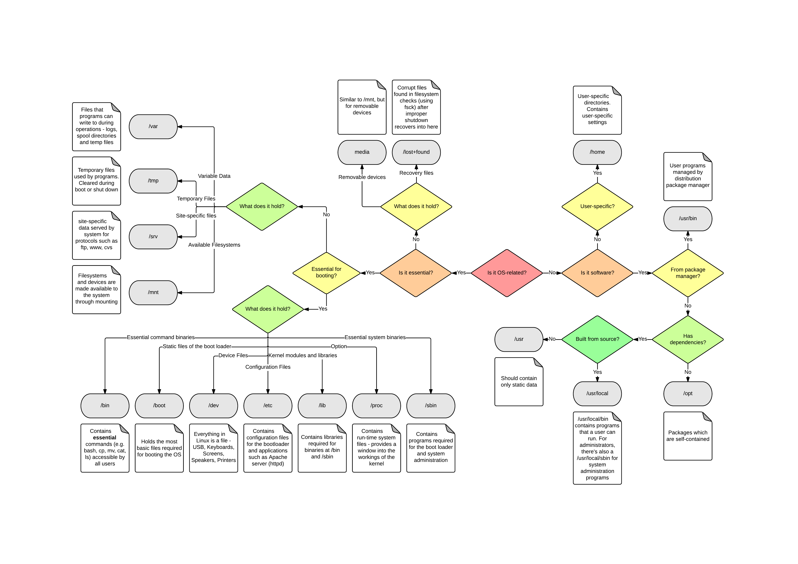

# Installing Kubernetes on my Raspberry Pi 

## Setting up the Pi 

To identify ourselves for SSH, we can use an SSH key-pair. If you don't already have one, you can create one: 

* Run ssh-keygen -t rsa
* Use the default file `~/.ssh/rsa_id`, and choose a passphrase; this will be your way to identify yourself to other machine

The Pi runs an image that is loaded onto an SSD card. Raspberry Pi has images software to create images.
 
* Select the OS; be sure to select Ubuntu server, not desktop
* Click on the "cog", and change the default settings
    * Disable password login, and enable SSH keypair login; use the public part of the keypair you just created 
    * Choose a hostname, username and password; you can leave these to the defaults, this will mean you can login using `pi@raspberrypi.local`. The `pi` user will have `NOPASSWD` set in `/etc/sudoers.d/90-cloud-init-users`, that will allow you to do root work without a password. 
    * Set the Wifi settings
* Create the image 

You should now be able to login to the pi through `ssh pi@raspberrypi.local`. I've had some issues with mDNS on Windows, running `dns-sd.exe -G v4 raspberrypi.local` fixed it. Don't know why... 

To be safe, it's usually a good idea to change the SSH default port. Typically, the SSH daemon service is configured by modifying `/etc/ssh/sshd_config`, but the latest version of Ubuntu uses a socket system, that triggers the start of the service once a request comes in. To set the port, modify ` /etc/systemd/system/ssh.socket.d/listen.conf`: 

```
mkdir /etc/systemd/system/ssh.socket.d 
cat > /etc/systemd/system/ssh.socket.d/listen.conf <<EOF
[Socket]
ListenStream=
ListenStream=12345
EOF
```

Reboot for this change to take effect, and reconnect using `ssh pi@raspberrypi.local -p 12345`.

## Setting up Kubernetes 

Next, we'll install Kubernetes. There's several options out there, but we'll use K3s. It comes with the most basic utilities, including kubectl, coreDNS, Traefik load balancer, Traefik ingress controller, and Rancher local path provisioner.

Install K3s:

```
sudo apt update
sudo apt install linux-modules-extra-raspi
curl -sfL https://get.k3s.io | sh -
```

Configure kubectl:

```
export KUBECONFIG="$HOME/.kube/config"
cat >> ~/.profile <<EOF
export KUBECONFIG="$KUBECONFIG"
EOF
mkdir ~/.kube 2> /dev/null
sudo k3s kubectl config view --raw > "$KUBECONFIG"
chmod 600 "$KUBECONFIG"
```

## Setup k9s

K9s - pronounced canines, like the dawgs - is a nice terminal based management tool for K8s. I install it by downloading the binary from Github. 

```
curl -OL https://github.com/derailed/k9s/releases/download/v0.26.7/k9s_Linux_arm64.tar.gz
tar -xf k9s_Linux_arm64.tar.gz
sudo mv k9s /usr/local/bin
```

It was a bit tricky to find where to put everything under Linux, but I found this flowchart very helpfull. 



## Deploy a Hello, World app

Launch the app from the K8s [manifest](./manifests/exampe-app.yaml):

```
kubectl apply -f manifests/example-app.yaml
```

Wait for it to start, and access it: 

``` 
curl http://localhost:8080
```

## Configuring storage 

I wanted to mount some storage, that I can also access easily from the host, to see how volumes work in Kubernetes. I've created an example of using a statically created PV mounted to a pre-configured directory on the host. To run it, do: 

``` 
sudo mkdir -p /home/storage-example/data
kubectl apply -f manifests/storage-example.yaml
```

Once the configured job ran, you'll see a file at `/home/storage-example/data/data.txt` that contains a hello world. 
